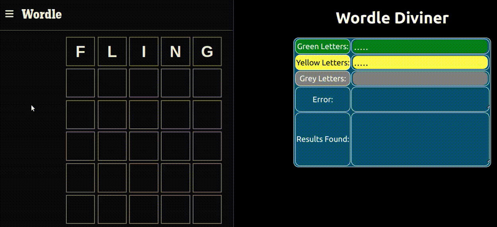
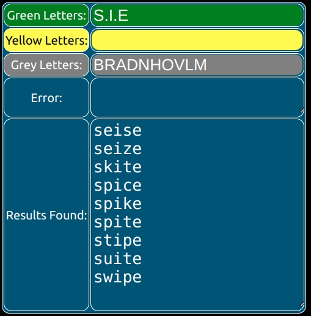

# Wordle Diviner

<em>
This program is free software: you can redistribute it and/or modify it 
under the terms of the GNU General Public License as published by the 
Free Software Foundation, either version 3 of the License, or 
(at your option) any later version.

This program is distributed in the hope that it will be useful, 
but WITHOUT ANY WARRANTY; without even the implied warranty of 
MERCHANTABILITY or FITNESS FOR A PARTICULAR PURPOSE. 

See the GNU General Public License for more details.

***
</em>

This browser-based utility helps you divine the answer to Wordle and its many copycats.

GitHub source code:

`git clone https://github.com/wolfegit/WordleDiviner.git`

Video clip (40 seconds):

## How to Use

Steps:
1.  Run the application side-by-side with Wordle.
2.  To start, guess any random 5-letter word in Wordle.
3.  Add letters to Wordle Diviner based on their color:
    
    - Green and Yellow input must be 5 characters.  Use the period (.) to pad as widlcards. Example:

        <code>TR..K</code>

    - Grey letter input has no limit

4.  Validation

    - The same letter cannot appear in both <code>GREEN</code>
and
<code>YELLOW </code>

    - The same letter cannot appear in both <code>GREEN</code>
and 
<code>GREY</code>

    - The same letter cannot appear in both 
<code>YELLOW</code>
and
<code>GREY</code>

    - <code>GREEN</code>
and
<code>YELLOW</code> cannot have conflicting letter positions. Example:

        <code> P....</code>

        <code> C....</code>

5. As you type in letters for each color, the results changes dynamically. 

6.  TIPS: Words ending in "S" - plurals and 3rd person verb conjugations.  The Wordle dictionary does not include these, so avoid them when guessing from the Results list.

    - Avoid guessing plural words (e.g. FACES)

    - Avoid guessing 3rd person verbs (e.g. WALKS)

    - For details, see code from this Wordle clone and its source dictionary:

        https://github.com/lynn/hello-wordl

        https://norvig.com/mayzner.html

7. TIPS: It's best to choose the "best" word from the list.  Wordle and others use heuristic tables when choosing their answers.  Of these actual results, for example, which would you choose?

    There are several good words: of the best are `spice`, `spike`, `spite` and `swipe`.  ***`spice`*** is the correct answer, the most common, obvious word.

 

Also, avoid vulgar words (i.e. cuss words). Wordle (and others) use heuristics to filter out these words. 

8.  Usually you can solve the puzzle after 3 or 4 hints from Wordle Diviner.

## How it Works

Wordld Diviner is written in HTML, Javascript and React. 

The entire dictionary file is loaded at runtime; this may make the page initially slow to load, but dictionary lookups are lightning fast with no network traffic.

As the user types the application uses 
<code> GREEN</code>
,
<code> YELLOW </code>
and
<code> GREY</code>
letters in a complex RegEx (regular expression) against a dictionary file, based on Unix/Linux GREP utility.  See the `GrepDictionary.js` file for the core lookup logic.

You may decide to swap out the dictionary file for a simpler word list or some other custom dictionary.  <code>dictionary.json</code> is (of course) in JSON format.  There are many online utilities to convert <code>txt</code> files to <code>json</code>.  Example JSON format:

<code>
[...
  
  "abandoned",  
  
  "abandoner", 
  
  "abandoners", 
  
  "abandoning",
  
  "abandonment", 
  
  ...]
</code>

Since Wordle Diviner is purely a web application, it has a mobile-friendly interface.
# Boilderpate Mardown Text
## Available Scripts

In the project directory, you can run:

### `npm start`

Runs the app in the development mode.Open <http://localhost:3000> to view it in your browser.

The page will reload when you make changes.You may also see any lint errors in the console.

### `npm test`

Launches the test runner in the interactive watch mode.See the section about [running tests](https://facebook.github.io/create-react-app/docs/running-tests) for more information.

### `npm run build`

Builds the app for production to the `build` folder.It correctly bundles React in production mode and optimizes the build for the best performance.

The build is minified and the filenames include the hashes.Your app is ready to be deployed!

See the section about [deployment](https://facebook.github.io/create-react-app/docs/deployment) for more information.

### `npm run eject`

**Note: this is a one-way operation. Once you** `eject`, you can't go back!

If you aren't satisfied with the build tool and configuration choices, you can `eject` at any time. This command will remove the single build dependency from your project.

Instead, it will copy all the configuration files and the transitive dependencies (webpack, Babel, ESLint, etc) right into your project so you have full control over them. All of the commands except `eject` will still work, but they will point to the copied scripts so you can tweak them. At this point you're on your own.

You don't have to ever use `eject`. The curated feature set is suitable for small and middle deployments, and you shouldn't feel obligated to use this feature. However we understand that this tool wouldn't be useful if you couldn't customize it when you are ready for it.

