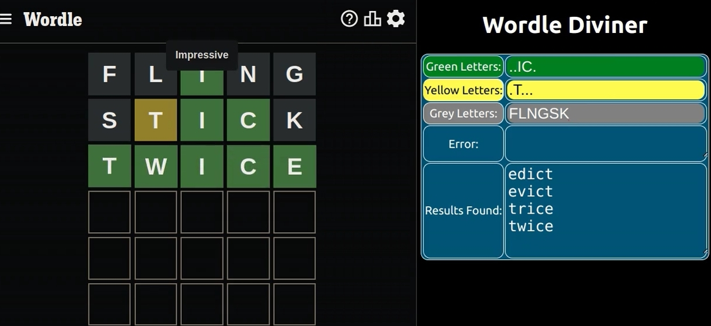

# Wordle Diviner

This browser-based utility helps you divine the answer to Wordle and its many copycats.

 

## How to Use

Steps:
1.  Run the application side-by-side with Wordle
2.  To start, guess any random 5-letter word in Wordle/
3.  Add letters to Wordl Divine based on their color
    
    - Green and Yellow input must be 5 characters.  Use the period (.) to pad as widlcards. Example:

        `TR..K`

    - Grey letter input has no limit

4.  Validation

    - The same letter cannot appear in both Green and Yellow

    - The same letter cannot appear in both Green and Grey

    - The same letter cannot appear in both Yellow and Grey

    - Green and Yellow cannot have conflicting letter positions. Example:

        `_Green P....`

        `Yellow C....`

5. As you type-in letters for each color, the results changes dynamically. 

6.  Words ending in "s" - plurals and 3rd person verb conjugation.  The Wordle dictionary does not include these, so avoid them when guessing from the Results list.

    - Avoid guessing plural words (e.g. FACES)

    - Avoid guessing 3rd person verbs (e.g. WALKS)

    - For details, see this Wordle clone and its source dictionary:

https://github.com/lynn/hello-wordl

https://norvig.com/mayzner.html

## How it Works

Wordld Diviner is written in HTML, React and Javascript.  A dictionary file is loaded at runtime.  

As the user types the application uses Green, Yellow and Grey letters in a complex RegEx (regular expression) against a dictionary file.  Based on Unix/Linux GREP utility.

# Boilderpate Mardown Text
## Available Scripts

In the project directory, you can run:

### `npm start`

Runs the app in the development mode.Open <http://localhost:3000> to view it in your browser.

The page will reload when you make changes.You may also see any lint errors in the console.

### `npm test`

Launches the test runner in the interactive watch mode.See the section about [running tests](https://facebook.github.io/create-react-app/docs/running-tests) for more information.

### `npm run build`

Builds the app for production to the `build` folder.It correctly bundles React in production mode and optimizes the build for the best performance.

The build is minified and the filenames include the hashes.Your app is ready to be deployed!

See the section about [deployment](https://facebook.github.io/create-react-app/docs/deployment) for more information.

### `npm run eject`

**Note: this is a one-way operation. Once you** `eject`, you can't go back!

If you aren't satisfied with the build tool and configuration choices, you can `eject` at any time. This command will remove the single build dependency from your project.

Instead, it will copy all the configuration files and the transitive dependencies (webpack, Babel, ESLint, etc) right into your project so you have full control over them. All of the commands except `eject` will still work, but they will point to the copied scripts so you can tweak them. At this point you're on your own.

You don't have to ever use `eject`. The curated feature set is suitable for small and middle deployments, and you shouldn't feel obligated to use this feature. However we understand that this tool wouldn't be useful if you couldn't customize it when you are ready for it.

